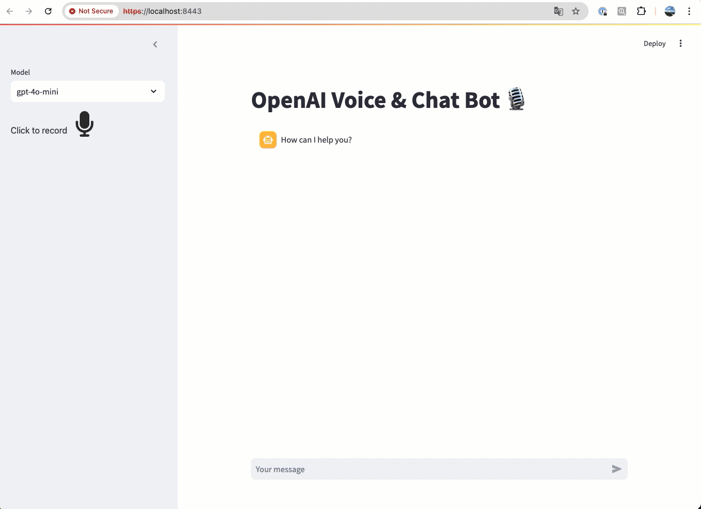

# Voice Chat Bot
A repository for voice chat bots 

## openai_voice_chat_bot
A Voice & Chat Bot 🎙️ backed by OpenAI, Streamlit and LangChain

Find the story in Medium [An OpenAI Voice & Chat Bot](https://medium.com/@yuxiaojian/an-openai-voice-chat-bot-b4cbe553f3ca)

### Run Locally
1. You need to have an OpenAI API key. You can  get it from [here](https://platform.openai.com/account/api-keys). Two ways to add your API key to the project:
- add it to the `.streamlit/secrets.toml` file of the current directory
```bash
openai_api_key = "your_api_key"
```
- input it in the browser


2. Install the requirements.
```bash
pip install -r requirements.txt
```
3. Run the app.
```bash
streamlit run openai_voice_chat_bot.py
```

<p align="center">
  
</p>

### Run remotely
The audio recording works with HTTPS (not HTTP). You will need a certificate and key to run the streamlit app in HTTPS. 

```bash
cat  ~/.streamlit/config.toml
...
[server]
port = 8443
sslCertFile = "<path to your certificate>"
sslKeyFile = "<path to your key>"
...
```

For testing purposes, you can use a self-signed certificate.
```bash
openssl req -newkey rsa:2048 -new -nodes -x509 -days 365 -subj "/CN=streamlit" -keyout streamlit.key -out streamlit.crt

```

